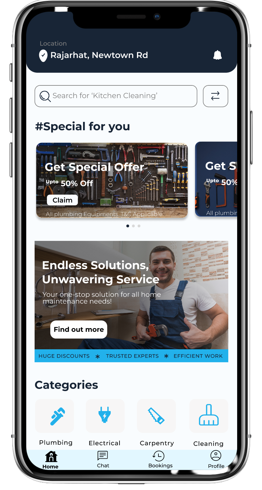
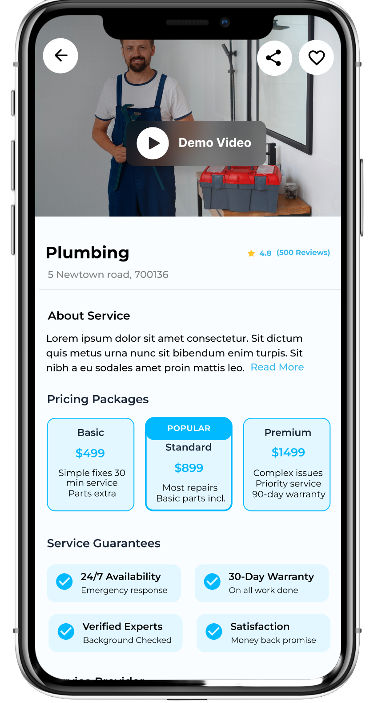
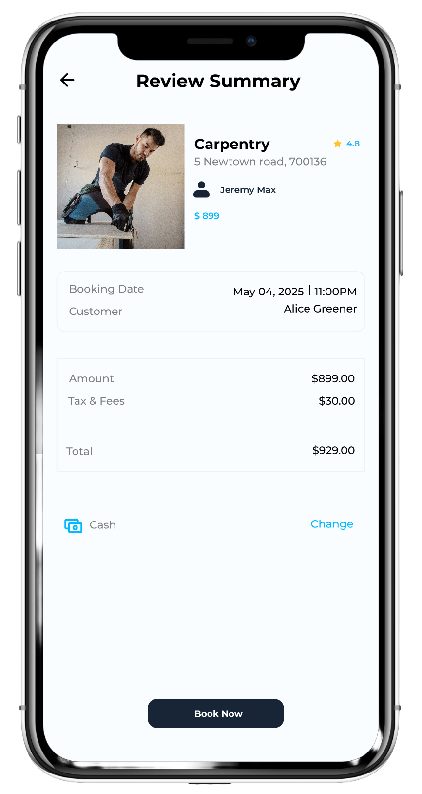
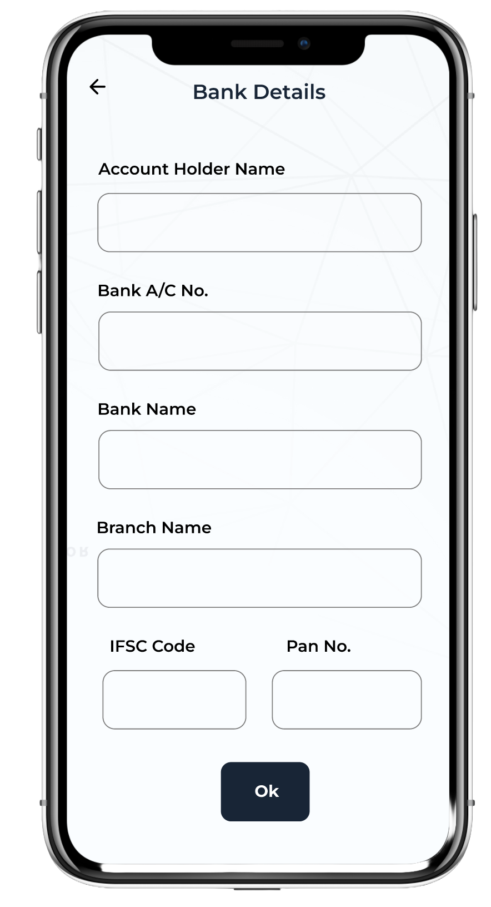

# Fixly – Local Service Booking App

Fixly is a mobile application that allows customers to book local services and enables service providers to manage bookings.

## My Role
UI/UX Designer

• User research  
• Wireframing  
• High-fidelity UI design  
• Mobile app interface design  
• User flows and interaction design  

## Tools Used
Figma

## Development
Android development implemented by: [Sujay Ghosh](https://github.com/CodeHunter1997)

Original development repository: [Fixly Local Service Booking](https://github.com/CodeHunter1997/Fixly-Local-Service-Booking)

This repository contains the Android implementation of the UI/UX design created by me.

## App Screens

### Loading Screen

  

### Splash Screen

  

### Accounts Booking

  

### login Screen

  

### Home Screen

  

### Service Booking

  

### Time slot Screen

  

### Total Payable Screen

  

###  Dashboard

  

### Payment Screen

  

### Service Provider booking Screen

  

