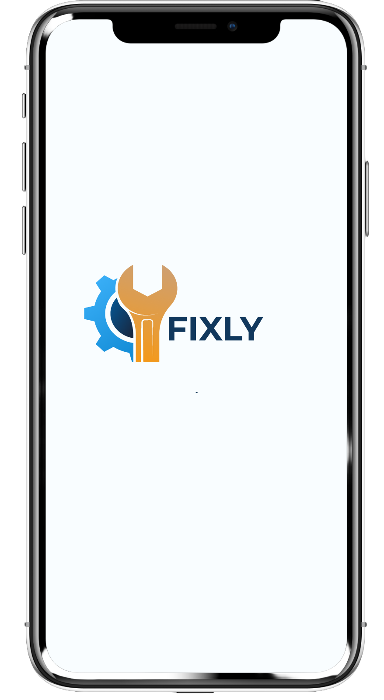
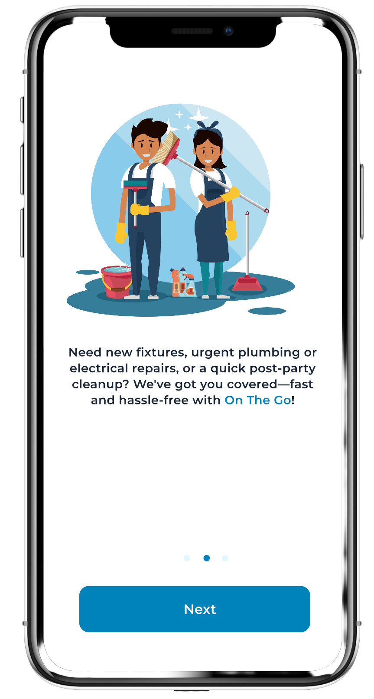
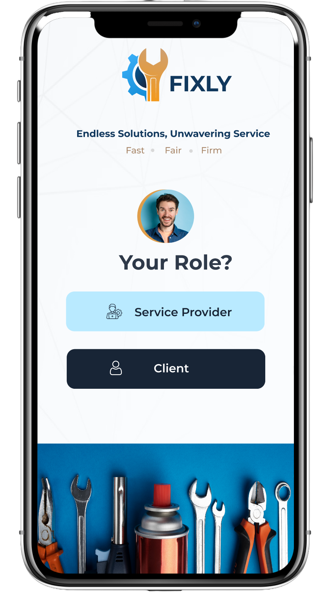
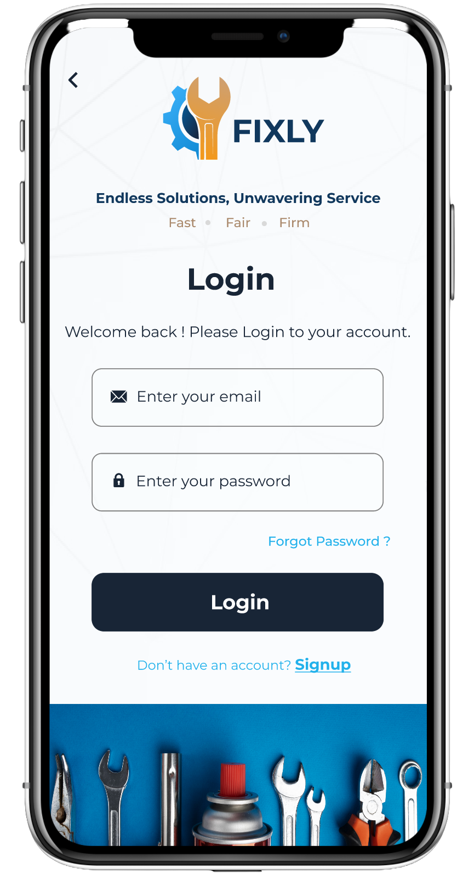
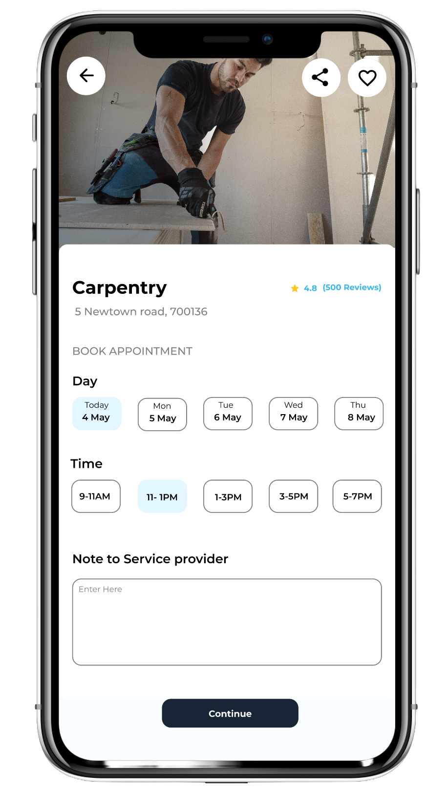
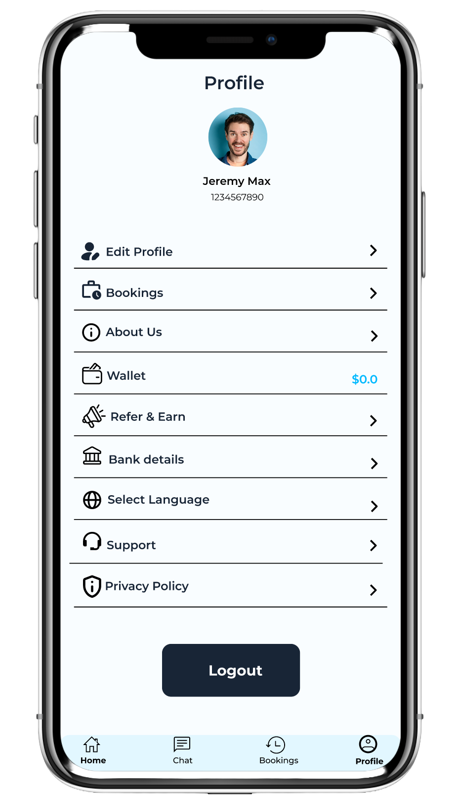
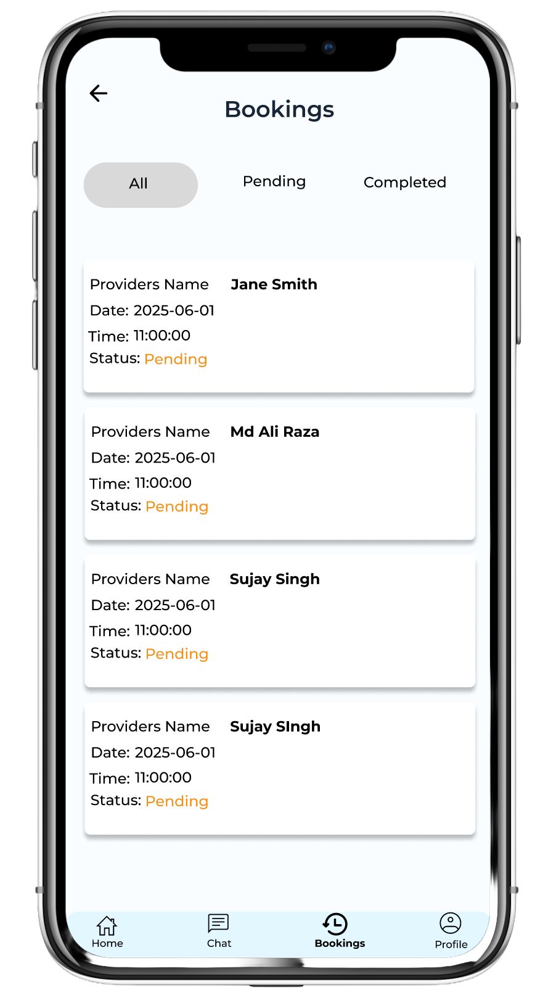

# Fixly – Local Service Booking App

Fixly is a mobile application that allows customers to book local services and enables service providers to manage bookings.

## My Role
UI/UX Designer

• User research  
• Wireframing  
• High-fidelity UI design  
• Mobile app interface design  
• User flows and interaction design  

## Tools Used
Figma

## Development
Android development implemented by: Sujay Ghosh

Original development repository:
https://github.com/CodeHunter1997/Fixly-Local-Service-Booking

This repository contains the Android implementation of the UI/UX design created by me.

## App Screens

### Loading Screen

### Splash Screen

### Accounts Booking

### Login 

### Home 

### Service 

### Time slot 

### Total Payable 

### Dashboard

### Payment 

### Service Provider Booking 
